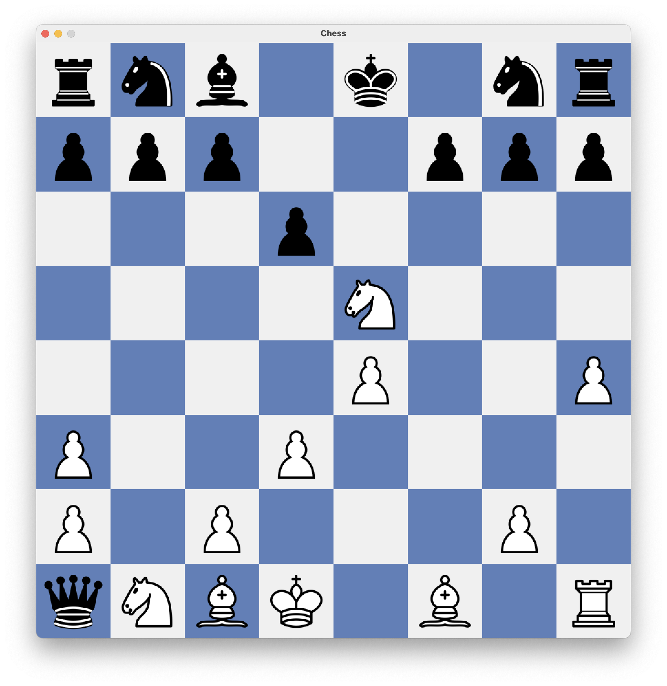

# Small Chess Program

This is a small implementation of the game of Chess using JAVA's Swing library. My hope is by the end of this project is to get a better understanding of Object-Oriented design and GUI programming. Much of the work here is inspired by the Chess Programming wiki (https://www.chessprogramming.org/Main_Page) and the YouTuber Sabatian Lague (https://www.youtube.com/@SebastianLague).


## The Chess Board
___
The class "Board.java" located in the "./src/Graphic" directory is in charge of presenting the board visually by utilizing Swing's JFrame, JPanel, and JLayeredPane. It's constructor takes as parameters an array list of pieces, a mouselistiner, and a mousemotionlistener.
<p>
The Chess Board is represented as a 2D array containing 64 tiles, where each tile has a different color than its adjacent tile. The records of each tile is stored in a GLOBAL variable which can be accessed through a getter method by all the other classes. Much of the game operates with this 2D array - the combination of each piece type and the location it resides in, we're able to generate the appropriate legal moves and potentially calculate the best move. 


```java
private Piece generatePiece(char name, boolean color, int locationX, int locationY)
```
<p>
One of the most important methods within this class is generatePiece(), which creates a new instance of the piece class and allocats space for the appropriate piece to be added to the chessboardi depending on its given parameters. Each piece is given a name, color, and location, all of which are taken into consideration when generating the piece.

## Board Representation and Examples
___
Fen Notation: "rnb1k1nr/ppp2ppp/3p4/4N3/4P2P/P2P4/P1P3P1/qNBK1B1R b kq h3 0 9".
<p>


## Compiling the Program
```
$ javac ./src/Main/Game.java
```
## Executing the Program
```
$ java ./Game
$ java ./Game "fen___string"
```
